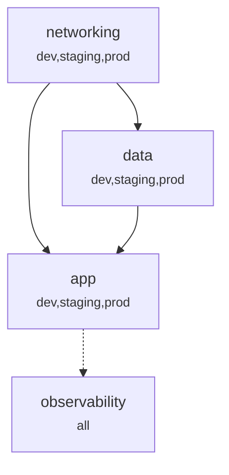

# `llm-arch` — render the infrastructure topology as a text diagram

Turns the `topology/` pillar's **declared** `depends-on` / `relates` edges into a text-mode architecture view: a **Mermaid** graph (renders as a real diagram in GitHub / Obsidian / IDEs) plus an **ASCII** apply-order layering for pure terminals. No new state — this reads the topology and draws it. The graph is only as good as what the topology declares; it never invents connectivity.

## What the edges mean

- A topology area's frontmatter `depends-on:` lists the stacks that must be **provisioned first** — i.e. this stack consumes their outputs. So `A.depends-on = [B]` ⇒ the arrow is **`B --> A`** (B is the prerequisite; outputs/apply-order flow B → A).
- `relates:` is a soft cross-link ("consider") — render it **dashed**.
- `depends-on` must be a **DAG** (it is the apply order). If you detect a cycle, that is a real defect — surface it, don't draw it as if valid.

## Data sources (cheapest first)

1. **`topology/index.md` table** — v4 `[Link, Description]` shape: one row per `topology/<area>/index.md`. The shallow index gives every node; for edges, drill into each area's frontmatter `depends-on:` (apply order) and `relates:` (cross-links).
2. **Drill into `topology/<area>/index.md`** only when the user wants more than the skeleton — the frontmatter `depends-on`/`relates`/`apps` (authoritative over the table if they ever differ) and the `## Interface` section (inputs/outputs) to label *what* flows on an edge.
3. **`runbooks/<slug>/index.md` `relates:`** — only when asked to overlay operations ("show which runbooks touch which stacks").

## Steps

1. Read `topology/index.md`. Build the node set (each area `Path`) and the edge set (`depends-on` = solid, `relates` = dashed). Capture each node's `apps` (environments).
2. If the user asked to scope it (one environment, one subtree, "around stack X"), **prune** to the relevant nodes + their declared neighbours — don't render the whole tree when a slice was asked for.
3. If asked for detail, drill per step 2/3 above to label edges with what flows (from `## Interface`) and/or overlay runbooks.
4. Render **Mermaid** (default `graph TD`, top-down = foundational stacks on top). Then render the **ASCII** apply-order layering. Output both to chat.
5. If `depends-on` has a cycle, or an edge points at a path with no `topology/<area>/`, call it out explicitly under the diagram.

## Mermaid output (template)

````

````

When environments matter, you may group with `subgraph dev` / `subgraph prod`, or add `classDef` colours — but only if it aids reading; default to env badges in the node label.

## ASCII output (apply-order layering)

A topological layering — stacks with no `depends-on` first, each later layer depending only on earlier ones. This reads as "provision top-to-bottom":

```
Layer 0 (no prerequisites):
  • networking            [dev,staging,prod]

Layer 1 (depends on Layer 0):
  • data        ← networking          [dev,staging,prod]

Layer 2 (depends on ≤ Layer 1):
  • app         ← networking, data    [dev,staging,prod]
        ┄ relates → observability
```

Notes:
- A node that several stacks depend on appears once; its dependents list it as a `←` prerequisite (diamonds are fine — show the prerequisite on each dependent).
- Put `relates` as `┄ relates →` lines under the node, visually distinct from the solid `←` prerequisites.

## Scope & honesty

- **Render only what is declared.** `depends-on`/`relates` are the source of truth. If the user wants runtime data-flow that the topology doesn't capture, pull it from each area's `## Interface` (inputs/outputs) — and if it isn't there either, say so rather than inventing edges.
- This skill is **read-only**. To persist the diagram as a living in-repo artifact (e.g. a generated `topology/architecture.md`), that's a separate, deliberate step the user must ask for — it needs careful placement so `llm doctor`'s pillar-orphan check doesn't flag it.
- Not to be confused with the loading-rule traversal (`expand`): that decides *what to load*; this *draws* the same declared edges.

## Patterns

| User says | You do |
|---|---|
| "Draw the architecture" / "diagrama da arquitetura" | Read `topology/index.md` → render Mermaid + ASCII to chat |
| "What's connected to `app`?" / "o que depende de `app`" | Prune to `app` + its `depends-on`/`relates`/dependents; render that slice |
| "Show apply order for prod" | Filter nodes whose `apps` include `prod` (or `all`); render the ASCII layering |
| "Which runbooks touch the data stack?" | Read `runbooks/*/index.md` `relates:`; overlay onto the diagram |
| "Put this diagram in the repo" | Explain the living-artifact follow-up (placement vs doctor); only then write it |
